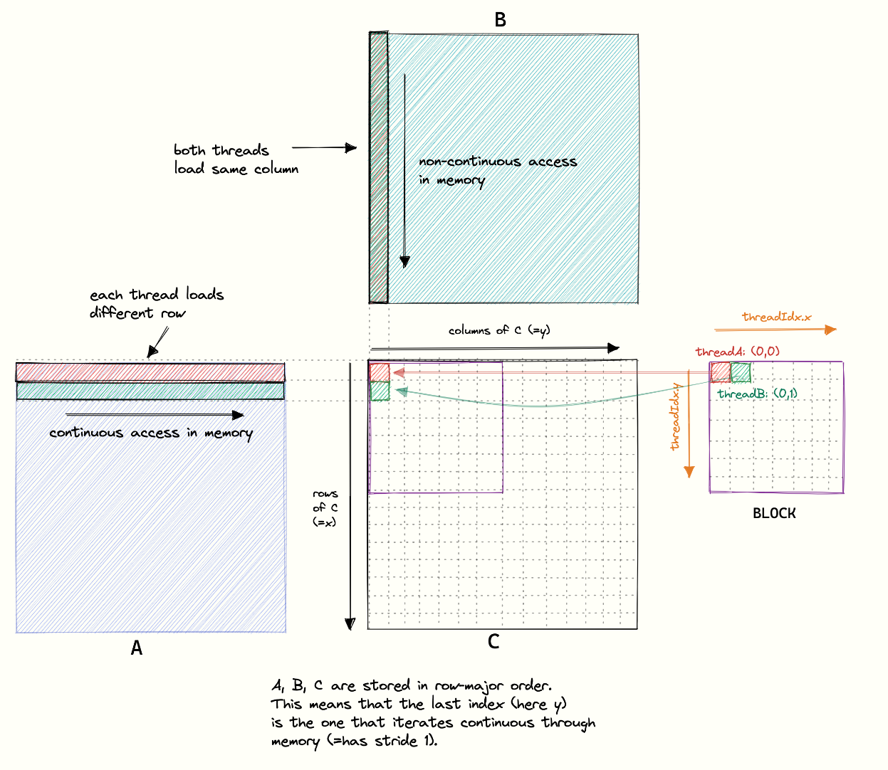
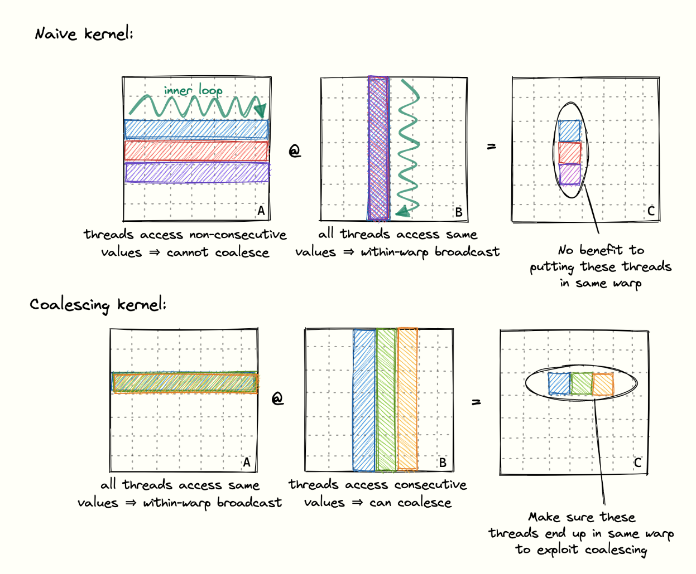
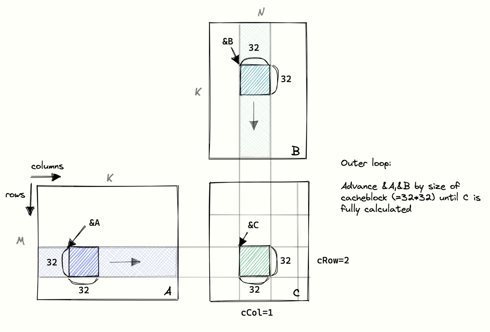
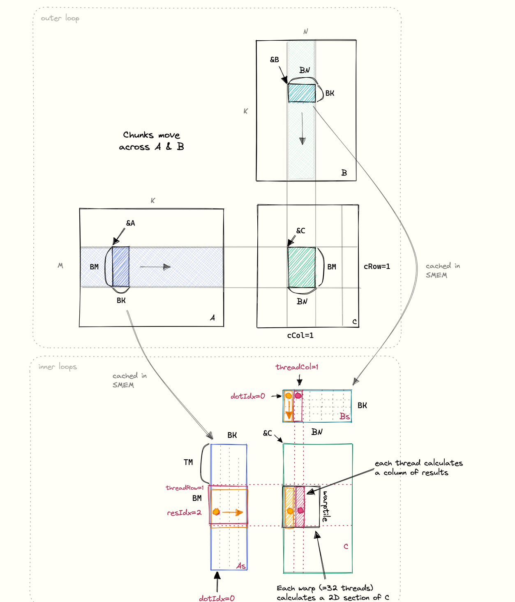

# GEMM

**Disclaimer**: This project is heavily inspired by <https://github.com/siboehm/SGEMM_CUDA> and I want to sincerely thank the author for the amazing work. The project is for my own educational purposes.

Compile and run assuming you have libnpy under `$HOME/libs`:

```bash
nvcc gemm.cpp gemm.cu -o gemm -I. -I./src -I/${HOME}/libs/libnpy-0.1.0/include --std=c++17 && ./gemm
```

## General GPU

- Consists of cores, which contain an ALU + FPU
- ALU emulates FP-ops with INT-ops (takes several cycles)
- FPU achieves almost one FP-op per cycle
- thread is a software concept, cores are hardware
- three-level compute hierarchy: Grid -> Block -> Thread
- warp = 32 threads of a block with consecutive `threadID`
- warps execute together on an SM (streaming multiprocessor)
- threads within a warp execute the same intructions
- when a warp initiates a memory request, the SM switches to another warp to hide latency
- four warp-schedulers per multiprocessor
- GPUs support 32B, 64B, and 128B memory accesses
- blocks are mapped onto SMs in a one-to-one manner
- warps are mapped onto cores in a one-to-one manner
  - each warp is assigned to a single phyical core
- threads are mapped onto cores in a many-to-one manner
- number of threads per core depends on specific architecture
- if there are more blocks than SMs, the blocks are queued and execute in round-robin manner
- Sequential memory accesses by same warp can be grouped (coalescing)
  - but only if data is consecutive in memory and access is aligned

## GEMM specs

Ran this on my RTX 3070 Laptop GPU

- Max throughput per datasheet: 16 TFLOP/s
- Max memory BW: 384 GB/s
- ALUs: 5120
- SMs (Streaming Multiprocessor): 40, i.e. 128 cores per SM
- Core config: 160:80:40:160
- Clock speed: 1935 MHz (measured)
- Measured max throughput: 5120 \* 1935 MHz \* 2 FLOP = 20 TFLOP/s

Multiplying two 2048 matrices requires

- flops: 2 * (2048)^3 = 17 GFLOP
- reads: 3 \* (2048)^2 \* 4B = 50 MB
- write: (2048)^2 * 4B = 17 MB

Theoretical time for the operations:

- compute: 17 GFLOP / 16 TFLOP/s = 1.1 ms
- memory: 70 MB / 384 GB/s = 0.2 ms

## Compute model

- 32 \* 32 = 1024 threads
- create a grid of (64, 64) with blocks of (32, 32), because 64\*32 = 2048
and we need 2048\*2048 threads (that's how many elements are in the output)
  - every group of 32 with consecutive thread ids is a warp
- cuda will create `64 * 64 * 32 * 32 = 4194304 = 2048^2` threads and map them to the hardware

    ```C++
    dim3 gridDim(ceil(NN / 32.0), ceil(NN / 32.0), 1); // 64, 64, 1
    dim3 blockDim(32, 32, 1);
    gemmKernel<<<gridDim, blockDim>>>(NN, NN, NN, A, B, C);
    ```

## 1. Naive kernel

~ x100 slower than optimum

- latency: 125 ms
- throughput: 138 GFLOP/S

Why?

- Every thread

```C
// Naive
const uint x = blockIdx.x * blockDim.x + threadIdx.x;
const uint y = blockIdx.y * blockDim.y + threadIdx.y;

```

The `threadIdx.x` determines threads that belong to same warp that can make use of coalesced memory accesses. Our problem is that `x` in cuda's world and `x` in our matrix world do not indicate the same thing. In cuda `x` goes right over the columns while in linear algebra land is goes down over the rows.

- This is illustrated here:
    

## 1.1 Simple Global Memory Coalescing

Instead of what is described in 2. I found that simply inverting x, y index calculation gives a similar boost as the "more complex" x-y calculation under 2.

```C
const uint y = blockIdx.x * blockDim.x + threadIdx.x;
const uint x = blockIdx.y * blockDim.y + threadIdx.y;

dim3 gridDim(ceil(NN / 32.0), ceil(NN / 32.0), 1);
dim3 blockDim(32, 32, 1);
gemmKernel<<<gridDim, blockDim>>>(NN, NN, NN, A, B, C);
```

We have to be a bit careful on the grid size and out of bounds checks, but apart from that this should work.

- latency: 25 ms
- throughput: 680 GFLOP/S

## 2. Global Memory Coalescing

Sequential memory accesses by threads that are part of the same warp can be coalesced. Optimizing for global memory coalescing on GPU similar to optimizing for cache line utilization on CPU. Note: To allow coalescing the threads within a warp have to access consecutive addresses, but the accesses don't have to be consecutive within a warp.

- we know that threads of one warp should access memory that's close
- key idea: change assignment of positions in output matrix `C` to threads
  - right now consecutive threads (warp) are mapped to consecutive rows
  - that means consecutive threads access consecutive rows of `A` and since matrix is stored row-major the accesses from multiple threads cannot be coalesced
  - if instead consecutive threads are mapped to consecutive columns, now they access consecutive columns of input `B`
  - this means that thread 0, 1, 2 etc. access values of a row of `B` (consecutive columns) and thereby memory can be coalesced
- `threadIdx.x`
  - consecutive `threadIdx.x` determine consecutive `x` which
    determine consecutive rows in the output matrix `C`
  - consecutive `threadIdx.x` also indicate threads of the same warp
  - to compute consecutive rows of the output `C` we need to load consecutive rows of `A`, while keeping the column of `B` constant

```C
const int x = blockIdx.x * BLOCKSIZE + (threadIdx.x / BLOCKSIZE);
const int y = blockIdx.y * BLOCKSIZE + (threadIdx.x % BLOCKSIZE);

dim3 gridDim(ceil(NN / 32), ceil(NN / 32), 1);
dim3 blockDim(32 * 32);
gemmKernel<<<gridDim, blockDim>>>(NN, NN, NN, A, B, C);
```

- `x` is the row (down) and `y` is the column (right)
  

- latency: 20 ms
- throughput: 810 GFLOP/S

## 3. Shared Memory

- Next to large global memory, GPUs have small, local SRAM next to each SM.
- logically local SRAM is partitioned among the blocks
- threads can communicate to others threads in block via their shared memory chunk
- 48 kB SMEM according to author, likely 128 kB for my GPU

- idea: compute matrix in blocks, load as much data as possible into fast shared memory and perform as much work as possible on it 

```c++
#define BLOCKSIZE 32
int cRow = blockIdx.x;
int cCol = blockIdx.y;

int threadRow = threadIdx.x / BLOCKSIZE
int threadCol = threadIdx.x % BLOCKSIZE

A += cRow * BLOCKSIZE * K;
B += cCol * BLOCKSIZE;
C += BLOCKSIZE * (cRow * N + cCol);

// Allocate region in shared mem
__shared__ float As[BLOCKSIZE*BLOCKSIZE];
__shared__ float Bs[BLOCKSIZE*BLOCKSIZE];

for (int bIdx = 0; i < K; bIdx+=BLOCKSIZE) {
  As[threadRow * BLOCKSIZE + threadCol] = A[threadRow * K + threadCol]
  Bs[threadRow * BLOCKSIZE + threadCol] = B[threadRow * N + threadCol]
  __syncthreads();
  A += BLOCKSIZE;
  B += BLOCKSIZE * N;
  for (int dotIdx = 0; dotIdx < BLOCKSIZE; ++dotIdx)
      tmp += As[threadRow * BLOCKSIZE + dotIdx] * B[dotIdx * BLOCKSIZE + threadCol]
  __syncthreads();
}

C[threadRow * N + threadCol] = tmp;
```

- latency: 15.5 ms
- throughput: 1100 GFLOP/S

## 4. 1D Blocktiling

- In 3. Shared Memory each thread only computes one result



```c++
template <const int BM, const int BN, const int BK, const int TM>
__global__ void blockTilingKernel(const int N, float *A, float *B, float *C){
  int cRow = blockIdx.y;
  int cCol = blockIdx.x;

  int threadRow = threadIdx.x / BN;
  int threadCol = threadIdx.x % BN;

  __shared__ float As[BM*BK];
  __shared__ float Bs[BN*BK];

  int innerRowA = threadIdx.x / BK;
  int innerColA = threadIdx.x % BK;
  int innerRowB = threadIdx.x / BN;
  int innerColB = threadIdx.x % BN;

  A += cRow * K * BM;
  B += cCol * BN;
  C += cRow * N * BM + cCol * BN;

  for (int bIdx = 0; bIdx < K; ++bIdx){
    for (int dotIdx = 0; dotIdx < BK; ++dotIdx){
      for (int )
    }
  }
}

// Invoked like:
const uint BM = 64; 
const uint BN = 64;
const uint BK = 8;
const uint TM = 8;

dim3 gridDim(ceil(N / BN), ceil(N / BM)) // Need N/BN blocks in x and N/BM blocks in y to compute full result
dim3 blockDim(BM * BN / TM) // BM*BN-sized chunks of the output
blocktilingKernel<BM, BN, BK, TM>
      <<<gridDim, blockDim>>>(N, A, B, C)
```

# Open Questions

- Why is 1.1 slower than 2 even though both achieve coalesced memory accesses?
